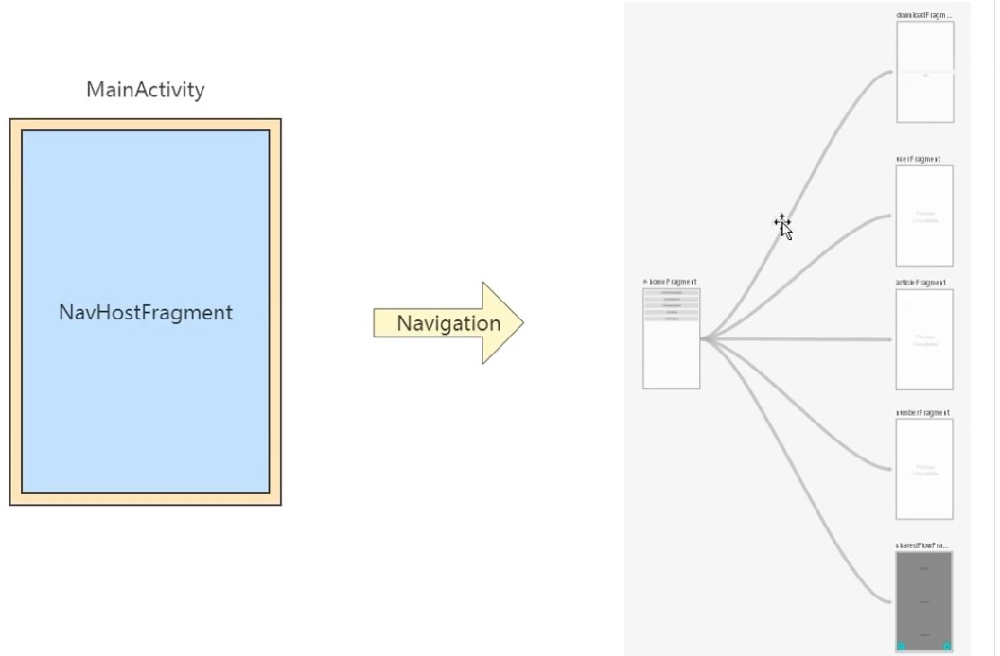
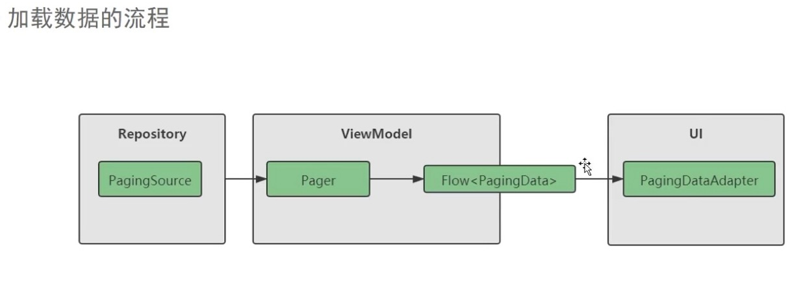
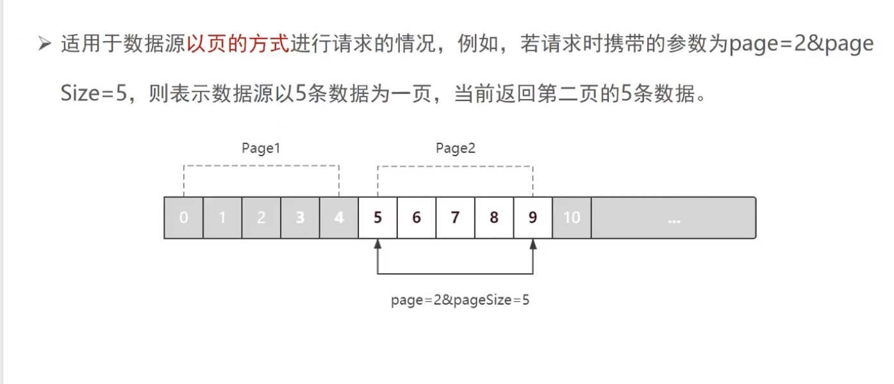

# FlowPractice 协程的Flow实战




- Download 文件下载
> Flow 主要用于 `异步返回多个值`，文件下载就是Flow 最经典的一个应用场景
>


- Retrofit ：网络数据

- Room ：Jetpack 本地数据库

- stateFlow & SharedFlow ：热流
> FLOW 是冷流
> 
> 什么是冷流？
> 
> 简单来说，就是如果Flow 有了订阅者Collector 以后，发射出来的值才会实实在在存在于内存中。
> 这跟懒加载的概念很像。
> 
> 与之相对的是 `热流`，`StateFlow` 和 `SharedFlow` 是热流，在垃圾回收之前，都是存在内存之中的，并且处于活跃状态。
> 

> **stateFlow** : 是一个状态器式 `可观察数据流`，可以向其收集器发出当前状态更新和新状态更新。
> 还可通过其 value属性读取当前状态值。
> 

### Flow 与 jetpack paging3


- 接口示例
> 
> https://www.kuaikanmanhua.com/v1/search/topic?q=任翔&f=3&size=18
> 
> http://m.kuaikanmanhua.com/search/mini/hot_word?&page=1&size=10
> 
> http://m.kuaikanmanhua.com/search/mini/hot_word?&page=2&size=10
> 
> http://m.kuaikanmanhua.com/search/mini/hot_word?&page=3&size=10
> 
> http://m.kuaikanmanhua.com/search/mini/hot_word?&page=4&size=10
> 

#### paging3
  
- 加载数据的流程
> 


- 分页逻辑
>


- 上游数据的缓存：屏幕旋转后，都会重新加载数据，解决此种情况

`.cachedIn(viewModelScope)`

> viewmodel, 放到属性上面去保存
> 
> 优化后，同时不会有内存泄漏的风险
> 
> **优化前：**
> 
```kotlin
fun loadMovie() : Flow<PagingData<Movie>> {
        return Pager(
            config = PagingConfig(
                pageSize = PAGING_PAGE_SIZE,
                // 滑动到 item位置加载更多
                prefetchDistance = 1,
                initialLoadSize= PAGING_INITIAL_PAGE_SIZE
            ),
            pagingSourceFactory = {MoviePagingSource()}
        ).flow
    }

```


> > **优化后：**
```kotlin
 private val movies by lazy {
        Pager(
            config = PagingConfig(
                pageSize = PAGING_PAGE_SIZE,
                // 滑动到 item位置加载更多
                prefetchDistance = 1,
                initialLoadSize= PAGING_INITIAL_PAGE_SIZE
            ),
            pagingSourceFactory = {MoviePagingSource()}
        ).flow.cachedIn(viewModelScope)
    }
    
    fun loadMovie() : Flow<PagingData<Movie>> = movies

```


### kotlin及协程 的综合


